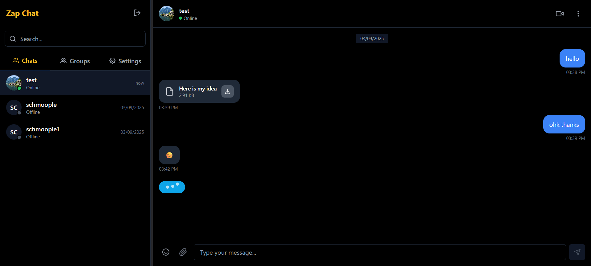
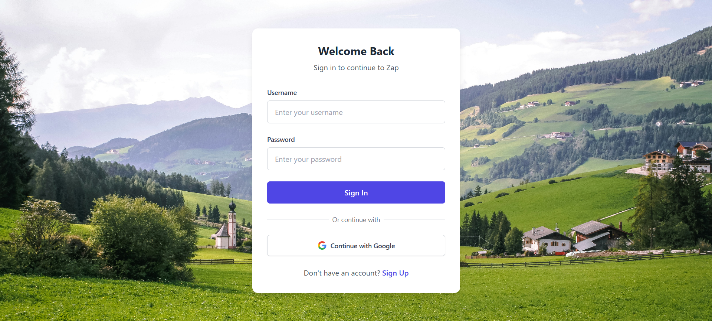
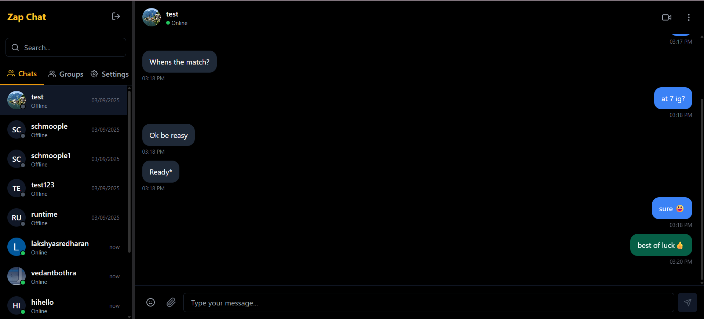
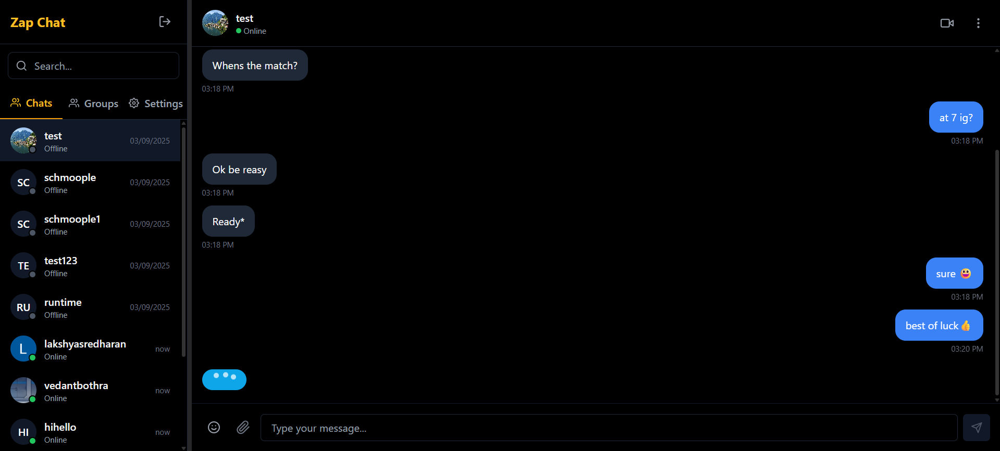
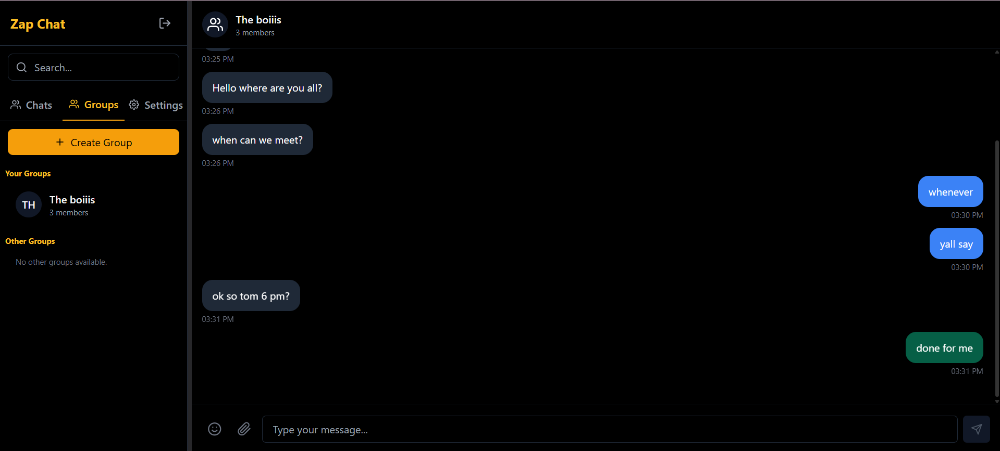
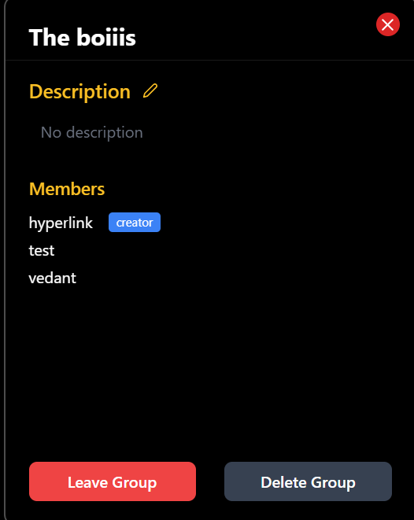
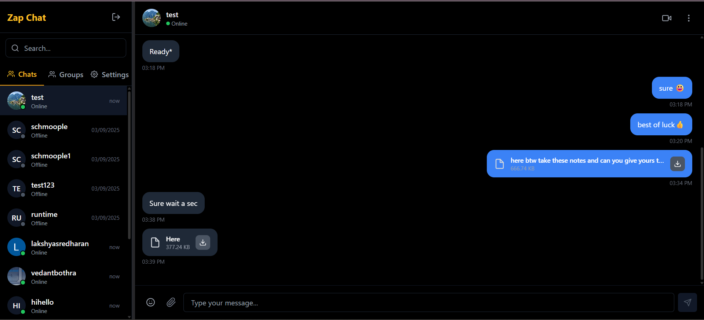
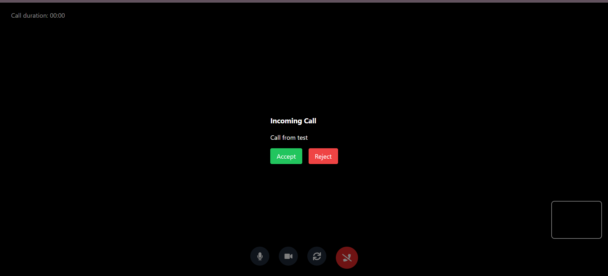
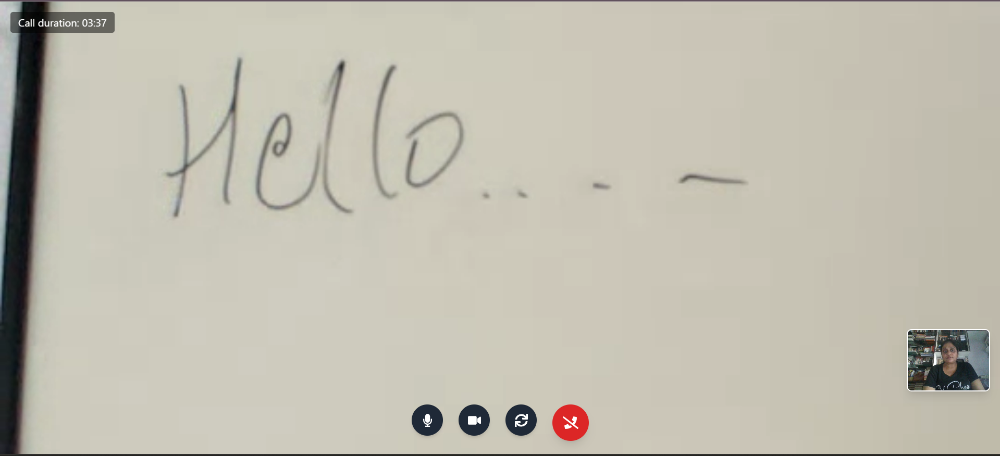

# Zap

Zap is a full-stack real-time communication platform focused on low-latency messaging and browser-based video calling. The project combines event-driven backend services with a responsive React client to support direct chat, group chat, media sharing, and WebRTC calls.

Live application: https://zap-nu.vercel.app/

## Project Focus

This project was built to solve practical real-time communication challenges in a production-style architecture:

- Reliable message delivery and read-state propagation
- Real-time user presence and typing feedback
- Scalable room-based communication for group chat
- File transfer and media persistence
- WebRTC call signaling with TURN-enabled connectivity for difficult network conditions

## Architecture

Zap follows a client-server architecture with dedicated real-time and persistence layers.

Client layer:

- React frontend with modular feature components
- Socket.IO client for real-time events
- WebRTC peer connection management for calls

Server layer:

- Express API for authentication, user, file, and group endpoints
- Socket.IO server for signaling and event fan-out
- Room-based event routing for direct and group interactions

Data and media layer:

- MongoDB (Mongoose) for user, message, and group persistence
- Cloudinary for file storage and delivery

Authentication and security:

- Google OAuth login flow via Passport
- JWT-based authorization for protected routes
- Session support for OAuth flows
- Guest invite tokens with expiry and room-scoped validation

## Real-Time System Design

The real-time system is organized around explicit event channels for clarity and control.

Messaging events:

- message send/receive
- message status updates
- read receipts
- delete propagation

Presence and UX events:

- typing start/stop
- user online/offline

Call signaling events:

- call start/accept/reject/end
- SDP offer/answer exchange
- ICE candidate relay

This separation makes each event path easier to test and reason about during failures.

## WebRTC and Call Reliability

Video calling is implemented with browser-native WebRTC and custom Socket.IO signaling.

Reliability-oriented implementation details:

- Configurable ICE server pipeline (STUN + TURN)
- TURN relay integration for NAT/firewall traversal
- ICE candidate handling with peer-scoped filtering
- Candidate queue/flush behavior around remote-description timing
- Connection reuse and cleanup controls to reduce stale state issues

## Technology Stack

Frontend:

- React (Vite)
- Tailwind CSS
- Socket.IO Client
- WebRTC APIs

Backend:

- Node.js
- Express
- Socket.IO
- MongoDB with Mongoose
- Passport (Google OAuth)
- JWT
- Multer
- Cloudinary

## Feature Set

### Direct Messaging

- Real-time one-to-one message delivery using Socket.IO
- Message lifecycle states: sent, delivered, and read
- Message history retrieval with date-based grouping
- Delete message propagation across active clients
- Clear-chat support for direct conversation reset

### Group Collaboration

- Group creation and membership-driven room communication
- Real-time broadcast of group messages
- Group-level read receipts
- Group message delete synchronization
- Shared file messaging in group channels

### Presence and Interaction Signals

- Typing start/stop indicators for active conversation context
- Online/offline presence updates
- Last-seen tracking and display logic
- Immediate UI updates through socket event fan-out

### Media and File Sharing

- File upload pipeline with backend validation
- Cloudinary-backed storage and retrieval
- File message bubbles for direct and group chat
- Attachment metadata handling (name, size, URL)

### Video Calling

- Call invitation workflow (start, accept, reject, end)
- WebRTC offer/answer exchange through Socket.IO signaling
- ICE candidate relay and peer-scoped candidate handling
- TURN-backed relay support for restrictive network environments
- In-call controls: mute, video toggle, and camera switching

### Authentication and Access Control

- Google OAuth login integration
- JWT-based protected API access
- Session-assisted OAuth flow
- Route-level auth enforcement via middleware

### Guest Demo Mode

- Private temporary room with a strict two-guest maximum
- Signed invite link flow with token expiry and nonce validation
- Guest-only event scoping for chat, typing, presence, and video calling
- Inactivity/expiry cleanup for guest rooms and guest accounts

## Feature Matrix

| Domain | Capability | Implementation Notes |
| --- | --- | --- |
| Messaging | Real-time direct chat | Socket.IO event channels with optimistic UI updates |
| Messaging | Delivery/read states | Status synchronization and message state transitions |
| Messaging | Message deletion | Socket event propagation to both participants |
| Groups | Group room messaging | Room-based broadcast via group identifiers |
| Groups | Group read receipts | Batched message ID updates and socket fan-out |
| Presence | Typing indicator | Start/stop typing events scoped by sender/receiver |
| Presence | User availability | Online/offline events with last-seen updates |
| Files | Attachment support | Multer upload handling + Cloudinary persistence |
| Calling | Signaling workflow | Offer/answer/ICE exchange over Socket.IO |
| Calling | Network reliability | STUN/TURN ICE server pipeline with relay fallback |
| Auth | Identity and sessions | Google OAuth, Passport, JWT, and session middleware |
| Auth | Guest demo access | Expiring two-user room links with scoped permissions |
| Persistence | Core data model | MongoDB models for users, messages, and groups |

## API Notes

- Health check: `GET /health`
- Success response: `200 OK` with body `Server is awake and healthy!`

## Codebase Organization

- `frontend/src/components`: UI modules for chat, groups, files, and calls
- `frontend/src/webRTC`: call signaling event wrappers and helpers
- `backend/src/controllers`: API controllers by domain
- `backend/src/routes`: REST route surfaces
- `backend/src/models`: Mongoose data models
- `backend/app.js`: Express + Socket.IO integration and event wiring

## Engineering Outcomes

- Built an end-to-end real-time communication stack instead of isolated feature demos
- Implemented practical WebRTC reliability improvements for real-world networks
- Structured socket event contracts to keep direct chat, group chat, and calls maintainable
- Shipped a deployable architecture using managed cloud services for database and media

## UI

### 1. Chat Interface

### 2. Login Page

### 3. Direct Messaging

### 4. Typing and Presence

### 5. Group Chat

### 6. Group Details

### 7. File Sharing

### 8. Incoming Call

### 9. Active Video Call

